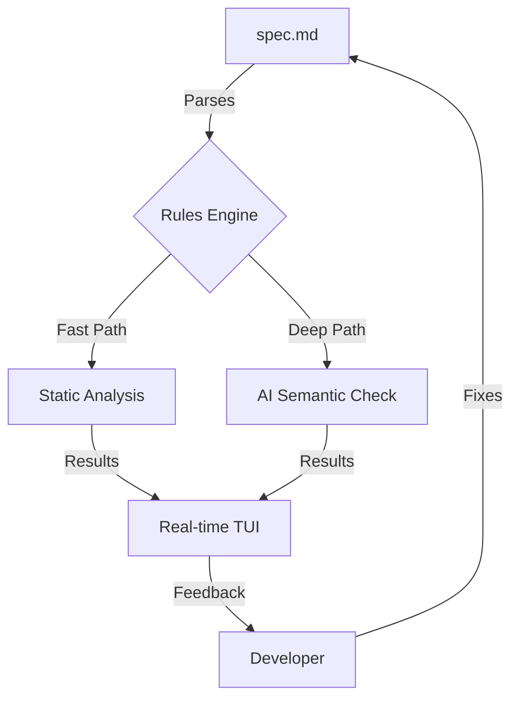
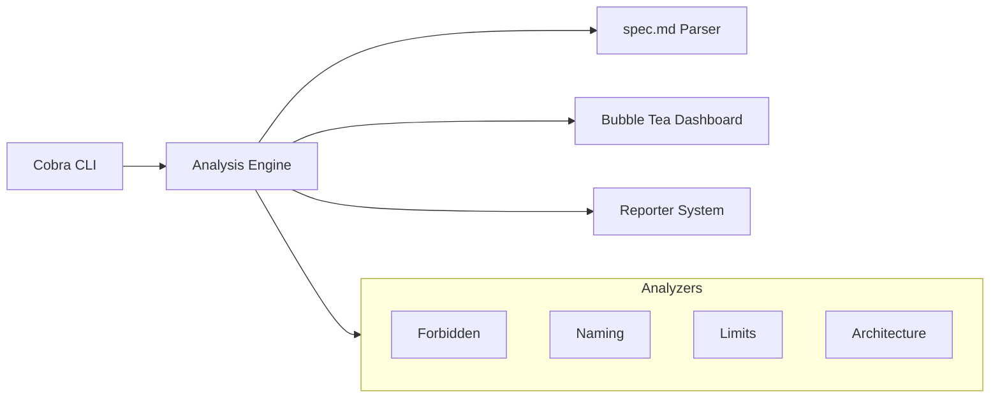

<p align="center">
  
</p>

<h1 align="center">Specwatch</h1>

<p align="center">
  <strong>Blazing fast, spec-driven static analysis for modern architecture.</strong>
</p>

<p align="center">
  
  
  
  
  
</p>

---

## ⚡ The Architectural Sentinel

Traditional linters enforce *how* you write code. **Specwatch** enforces *what* you build. By defining your project's architectural soul in a simple `spec.md`, Specwatch ensures your vision stays intact from the first commit to the millionth line.

### 🏗️ The Vision



> **Target Performance:** Sub-10ms static checks. Max 1 LLM call per 10 file saves.

---

## ✨ Features

- 🏎️ **Extreme Speed**: Static checks using regex and AST analysis run in milliseconds.
- 🎯 **Spec-First**: Centralized `spec.md` defines naming, structure, and boundaries.
- 🖥️ **Premium TUI**: A three-panel dashboard with activity feeds and live stats.
- 🧠 **Smart AI**: LLMs are used surgically only for high-level semantic rules.
- 🔄 **Live Watch**: Responsive file system watcher with intelligent debouncing.
- 📊 **CI-Ready**: Seamlessly integrates into your pipelines with JSON/Text reporting.

---

## 🖥️ Premium TUI Experience

Experience a terminal interface that feels like a mission control for your codebase.

- **Activity Feed**: Rolling history of file checks with status indicators.
- **Violation Center**: Navigable list of rules being broken, sorted by severity.
- **Live Stats**: Real-time counters for errors, warnings, and file coverage.
- **Detail View**: Expand any violation to see the offending code and fix suggestions.

---

## 🚀 Quick Start

### 📦 Installation

```bash
# Using Go
go install github.com/rajeshshrirao/specwatch@latest

# Verify
specwatch --version
```

### 🏁 Getting Started

1. **Initialize your specs**:
   ```bash
   specwatch init
   ```
2. **Launch the Sentinel**:
   ```bash
   specwatch watch ./src
   ```

---

## ⚙️ Configuration

Control Specwatch behavior via `.specwatch.yml`.

```yaml
# .specwatch.yml
llm:
  enabled: true
  provider: anthropic
  model: claude-3-haiku-20240307
  
watch:
  debounce: 800
  extensions: [go, ts, tsx, js, jsx]
  skip: [naming]
```

### 🧠 Smart LLM Usage

For AI-powered checks, export your provider key:

```bash
export ANTHROPIC_API_KEY="your-key-here"
```

**Intelligence Profile:**
- **Trigger**: Fires primarily on `## architecture` section rules.
- **Scope**: Handles semantic tasks like "no business logic in UI components".
- **Efficiency**: aggressive caching ensures your development loop stays fast.

---

## 📖 Command Reference

| Command | Short Description |
|:---|:---|
| `specwatch init` | Create a fresh `spec.md` template |
| `specwatch watch [path]` | Start real-time monitoring and TUI |
| `specwatch check [path]` | One-shot analysis for CI environments |

### 🛠️ Advanced Flags

**Watch Mode:**
```bash
specwatch watch ./src --ext ts,tsx      # Filter by extension
specwatch watch ./src --debounce 1200   # Custom debounce (ms)
specwatch watch ./src --skip "limits"   # Ignore specific categories
```

**Check Mode:**
```bash
specwatch check ./src --format json     # Machine-readable output
```

---

## 🏗️ Technical Architecture



---

## 🤝 Contributing

We love architectural purity and fast code! See our [Contributing Guide](CONTRIBUTING.md) to get started.

---

<p align="center">
  Made with ❤️ by <a href="https://github.com/rajeshshrirao">rajeshshrirao</a>
</p>
