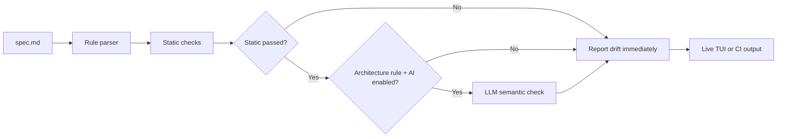

<p align="center">
  
</p>

<h1 align="center">Specwatch</h1>

<p align="center">
  <strong>Keep architecture from drifting while you code.</strong>
</p>

<p align="center">
  Specwatch watches your repo, reads a local <code>spec.md</code>, runs fast static checks first,
  and escalates to AI only when a rule needs semantic judgment.
</p>

<p align="center">
  
  
  
  
</p>

---

## Why Specwatch

Most tooling tells you whether code is valid.

Specwatch tells you whether code still matches the architecture you intended.

That makes it useful for:

- AI-assisted coding loops where code gets generated faster than humans review structure
- protecting boundaries like `no business logic in components`
- keeping imports, file size, naming, and layering aligned with project rules
- surfacing drift immediately in the terminal instead of after review or CI

## How It Works



The current core loop is:

1. Parse `spec.md`
2. Run static analysis first
3. If AI is enabled, only escalate architecture rules
4. In watch mode, budget AI to at most 1 call per 10 saves
5. Show live drift in the TUI or emit CI-friendly output in `check`

## Highlights

- Fast local checks for forbidden patterns, imports, naming, limits, required patterns, and basic architecture heuristics
- Live watch mode with a polished Bubble Tea terminal UI
- Resolved drift now clears correctly on common editor save patterns
- Optional AI checks for architecture rules when static analysis passes first
- Local per-repo config through `.specwatch.yml`
- Simple CLI for `init`, `watch`, `check`, and provider setup

## Quick Start

### Install

```bash
go install github.com/rajeshshrirao/specwatch@latest
```

### Create a spec

```bash
mkdir my-app && cd my-app
specwatch init
```

This creates a starter `spec.md` that you can tune to your repo.

### Start watching

```bash
specwatch watch .
```

### Run a one-shot check

```bash
specwatch check .
```

## The Two Files That Matter

### `spec.md`

This is the contract for your codebase.

Example:

```md
## forbidden
- pattern: "console.log"
  message: use logger utility from @/lib/logger

## architecture
- no direct db calls outside src/lib/db
- no business logic in components - belongs in hooks or lib

## limits
- max file lines: 300
- max imports per file: 20
```

### `.specwatch.yml`

This is optional runtime config and should live next to `spec.md`.

```yaml
llm:
  enabled: true
  provider: anthropic
  model: claude-haiku-4-5-20251002

watch:
  debounce: 800
  extensions: [go, ts, tsx, js, jsx]
```

If `.specwatch.yml` does not exist, Specwatch falls back silently to built-in defaults.

## AI Checks

AI is intentionally constrained.

- Static analysis always runs first
- AI only participates for rules from the `## architecture` section
- AI only runs when static analysis produced no violations for that file
- In watch mode, AI is limited to 1 call per 10 file saves
- If Anthropic is selected and `ANTHROPIC_API_KEY` is missing, Specwatch continues and prints a one-time warning

Set up a provider:

```bash
export ANTHROPIC_API_KEY="your-key"
```

Or inspect providers/models:

```bash
specwatch login --provider anthropic --list-models
```

Supported providers in the codebase:

- `anthropic`
- `openrouter`
- `gemini`

## Commands

| Command | What it does |
| --- | --- |
| `specwatch init` | Create a starter `spec.md` |
| `specwatch watch [path]` | Watch files and show live drift in the TUI |
| `specwatch check [path]` | Run a one-shot check for CI or scripts |
| `specwatch login` | Validate provider auth and inspect available models |

### Useful Examples

```bash
specwatch watch . --debounce 1200
specwatch watch ./src --ext go,ts,tsx
specwatch watch . --skip limits
specwatch check . --format json
specwatch version
```

## Terminal UI

Watch mode is designed to feel like a live architecture console:

- animated startup and shutdown sequences
- rolling activity feed with `drift`, `fixed`, and `clean` states
- violations sorted by severity and recency
- detail pane with excerpt and suggested fix
- compact fallback layout for smaller terminals

## Current Scope

What Specwatch is good at today:

- single-repo local enforcement
- lightweight architectural drift detection
- fast inner-loop feedback for teams using AI or moving quickly

What is still early:

- architecture detection is still heuristic in places
- AI gating exists, but the semantic path is intentionally narrow
- monorepo discovery and deeper project isolation are not the current focus

## Development

```bash
go build -o specwatch .
go test -v -race -cover ./...
go run . watch .
go run . check .
```

## Contributing

See [CONTRIBUTING.md](CONTRIBUTING.md).

If you contribute, keep the bar high:

- fast checks stay fast
- UI polish should not compromise clarity
- architecture rules should remain easy to understand and easy to extend

---

<p align="center">
  Built by <a href="https://github.com/rajeshshrirao">Rajesh Shrirao</a>
</p>
