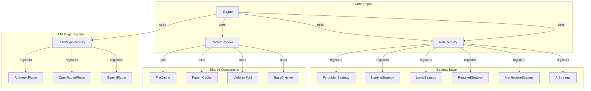

# Specwatch Modularization Plan

## Executive Summary

This document outlines a comprehensive plan to modularize Specwatch by:
1. Extracting common analysis patterns into reusable components
2. Implementing the Strategy pattern for different rule types
3. Creating a plugin architecture for LLM providers

---

## Current Architecture Analysis

### Existing Components

| Component | Location | Purpose |
|-----------|----------|---------|
| Engine | `internal/analyzer/engine.go` | Orchestrates all analysis checks |
| Static Checks | `internal/analyzer/static.go` | Regex-based forbidden patterns, naming, limits |
| AST Checks | `internal/analyzer/ast.go` | Heuristic-based try/catch and import boundary checks |
| Cache | `internal/analyzer/cache.go` | File content caching |
| Pattern Cache | `internal/analyzer/regex.go` | Compiled regex pattern caching |
| Memory | `internal/analyzer/memory.go` | Object pooling and memory monitoring |
| LLM Interface | `internal/llm/interface.go` | Abstract client interface |
| LLM Factory | `internal/llm/factory.go` | Creates LLM clients |

### Current Issues

1. **Tight Coupling**: Analysis checks are hardcoded in `Engine.Analyze()` - adding new rule types requires engine modification
2. **No Extensibility**: New LLM providers require factory updates
3. **Code Duplication**: Similar patterns repeated across check functions
4. **Testing Difficulty**: Hard to test individual check strategies in isolation
5. **Limited Reusability**: Common patterns not extracted for external use

---

## Target Architecture



---

## Implementation Plan

### Phase 1: Strategy Pattern for Rule Types

#### 1.1 Create Base Strategy Interface

**File**: `internal/analyzer/strategy/interface.go`

```go
// RuleStrategy defines the interface for analysis strategies
type RuleStrategy interface {
    // Name returns the unique identifier for this strategy
    Name() string
    
    // Category returns the category (for skipping)
    Category() string
    
    // Check performs the analysis and returns violations
    Check(ctx context.Context, params CheckParams) []Violation
    
    // CanCheck determines if this strategy can handle the given rule
    CanCheck(rule interface{}) bool
}

// CheckParams contains common parameters for all check operations
type CheckParams struct {
    FilePath    string
    Content     []string
    Rule        interface{}
    Cache       FileCache
    Compiled    map[string]*regexp.Regexp
}

// BaseStrategy provides common functionality for all strategies
type BaseStrategy struct{}
```

#### 1.2 Implement Concrete Strategies

| Strategy | File | Purpose |
|----------|------|---------|
| ForbiddenStrategy | `internal/analyzer/strategy/forbidden.go` | Pattern matching |
| NamingStrategy | `internal/analyzer/strategy/naming.go` | File naming conventions |
| LimitsStrategy | `internal/analyzer/strategy/limits.go` | Line/import limits |
| RequiredStrategy | `internal/analyzer/strategy/required.go` | Required patterns |
| ArchitectureStrategy | `internal/analyzer/strategy/architecture.go` | Import boundaries |
| AIStrategy | `internal/analyzer/strategy/ai.go` | LLM-powered analysis |

#### 1.3 Create Strategy Registry

**File**: `internal/analyzer/strategy/registry.go`

```go
type Registry struct {
    strategies map[string]RuleStrategy
    mu         sync.RWMutex
}

func (r *Registry) Register(strategy RuleStrategy) error
func (r *Registry) Get(name string) (RuleStrategy, error)
func (r *Registry) GetByCategory(category string) []RuleStrategy
func (r *Registry) List() []RuleStrategy
```

---

### Phase 2: Common Analysis Components

#### 2.1 Create Base Checker

**File**: `internal/analyzer/common/base_checker.go`

```go
// BaseChecker provides reusable analysis utilities
type BaseChecker struct {
    fileCache    FileCache
    patternCache PatternCache
}

func (bc *BaseChecker) GetFileContent(path string) ([]string, error)
func (bc *BaseChecker) GetOrCompilePattern(pattern string) (*regexp.Regexp, error)
func (bc *BaseChecker) IsSupported(path string, extensions []string) bool
func (bc *BaseChecker) ShouldSkip(path string, skipCategories []string) bool
```

#### 2.2 Create Line Processor

**File**: `internal/analyzer/common/line_processor.go`

```go
// LineProcessor provides common line-by-line analysis utilities
type LineProcessor struct{}

func (lp *LineProcessor) ProcessLines(content []string, fn func(line string, lineNum int) []Violation) []Violation
func (lp *LineProcessor) FindPatternMatches(lines []string, patterns map[string]*regexp.Regexp) []PatternMatch
func (lp *LineProcessor) ExtractImports(lines []string) []string
func (lp *LineProcessor) CountLinesOfCode(lines []string) int
```

#### 2.3 Create Violation Builder

**File**: `internal/analyzer/common/violation_builder.go`

```go
// ViolationBuilder provides fluent violation creation
type ViolationBuilder struct {
    v Violation
}

func NewViolationBuilder() *ViolationBuilder
func (vb *ViolationBuilder) WithFile(path string) *ViolationBuilder
func (vb *ViolationBuilder) WithLine(line int) *ViolationBuilder
func (vb *ViolationBuilder) WithRule(rule string) *ViolationBuilder
func (vb *ViolationBuilder) WithSeverity(sev spec.Severity) *ViolationBuilder
func (vb *ViolationBuilder) WithExcerpt(excerpt string) *ViolationBuilder
func (vb *ViolationBuilder) WithSuggestion(suggestion string) *ViolationBuilder
func (vb *ViolationBuilder) Build() Violation
```

---

### Phase 3: LLM Plugin Architecture

#### 3.1 Create Plugin Interface

**File**: `internal/llm/plugin/interface.go`

```go
// Plugin represents an LLM provider plugin
type Plugin interface {
    // ID returns the unique plugin identifier
    ID() string
    
    // Name returns the human-readable name
    Name() string
    
    // Version returns the plugin version
    Version() string
    
    // SupportedModels returns list of supported model IDs
    SupportedModels() []string
    
    // CreateClient creates an LLM client instance
    CreateClient(apiKey, model string) (llm.LLMClient, error)
    
    // Configure applies additional configuration
    Configure(config map[string]interface{}) error
}

// PluginMetadata contains plugin metadata
type PluginMetadata struct {
    ID          string
    Name        string
    Version     string
    Description string
    Author      string
}
```

#### 3.2 Create Plugin Registry

**File**: `internal/llm/plugin/registry.go`

```go
// Registry manages LLM provider plugins
type Registry struct {
    plugins map[string]Plugin
    mu      sync.RWMutex
}

// Global registry instance
var globalRegistry *Registry

func Register(plugin Plugin) error
func Get(id string) (Plugin, error)
func List() []Plugin
func Unregister(id string) error
```

#### 3.3 Auto-Registration

**File**: `internal/llm/plugin/autoload.go`

```go
// Built-in plugins are auto-registered via init()
func init() {
    plugin.Register(&anthropic.Plugin{})
    plugin.Register(&openrouter.Plugin{})
    plugin.Register(&gemini.Plugin{})
}
```

---

### Phase 4: Refactored Engine

#### 4.1 New Engine Design

**File**: `internal/analyzer/engine.go` (refactored)

```go
type Engine struct {
    registry    *strategy.Registry
    llmRegistry *plugin.Registry
    config      EngineConfig
}

type EngineConfig struct {
    Extensions     []string
    MaxFileSizeMB  int
    SkipCategories []string
}

func NewEngine(rules *spec.RuleSet) *Engine
func (e *Engine) RegisterStrategy(strategy strategy.RuleStrategy) error
func (e *Engine) Analyze(path string) ([]Violation, time.Duration)
func (e *Engine) AnalyzeAll(root string) ([]Violation, time.Duration)
```

---

## File Structure After Refactoring

```
internal/analyzer/
├── engine.go              # Refactored engine
├── cache.go               # Existing (unchanged)
├── memory.go              # Existing (unchanged)
├── types.go               # Existing (unchanged)
├── strategy/
│   ├── interface.go       # NEW: Strategy interface
│   ├── registry.go        # NEW: Strategy registry
│   ├── forbidden.go       # NEW: Refactored check
│   ├── naming.go          # NEW: Refactored check
│   ├── limits.go          # NEW: Refactored check
│   ├── required.go        # NEW: Refactored check
│   ├── architecture.go    # NEW: Refactored check
│   └── ai.go              # NEW: Refactored AI check
├── common/
│   ├── base_checker.go    # NEW: Shared utilities
│   ├── line_processor.go  # NEW: Line processing
│   └── violation_builder.go # NEW: Fluent builder
└── legacy/
    ├── static.go          # DEPRECATED: Move to strategy/
    ├── regex.go           # KEEP: Pattern utilities
    └── ast.go             # DEPRECATED: Move to strategy/

internal/llm/
├── interface.go           # Existing (minor updates)
├── factory.go             # Existing (minor updates)
├── anthropic.go           # Existing (as plugin)
├── openrouter.go          # Existing (as plugin)
├── gemini.go              # Existing (as plugin)
└── plugin/
    ├── interface.go       # NEW: Plugin interface
    ├── registry.go       # NEW: Plugin registry
    └── autoload.go       # NEW: Auto-registration
```

---

## Migration Path

### Step 1: Create New Components (Non-Breaking)
- Create `internal/analyzer/strategy/` directory
- Create `internal/analyzer/common/` directory
- Create `internal/llm/plugin/` directory

### Step 2: Implement New Components
- Implement strategy interface and registry
- Implement common utilities
- Implement plugin system

### Step 3: Dual Operation
- Keep existing Engine working
- Add new strategy-based Engine alongside

### Step 4: Migration
- Update CLI commands to use new Engine
- Mark old code as deprecated
- Remove legacy code after testing

---

## Benefits

| Area | Improvement |
|------|-------------|
| **Extensibility** | Add new rule types without modifying Engine |
| **Testability** | Test strategies in isolation |
| **Reusability** | Common components shared across strategies |
| **Plugin System** | Third-party LLM providers via plugins |
| **Maintainability** | Single responsibility per component |
| **Performance** | Object pooling and caching built-in |

---

## Backward Compatibility

- Keep existing `Engine` signature compatible
- New features are additive
- Legacy code moved to `internal/analyzer/legacy/`
- Factory continues to work for LLM clients
